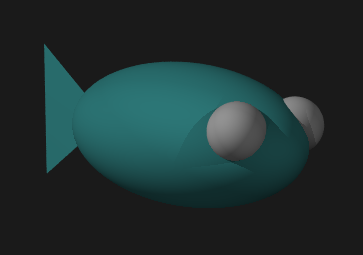

# RayFish

A terminal-based 3D fish animation written in Go, by Frank Buss.

## Usage

Run the program specifying the number of fish and whether to show the ground plane:

```bash
./rayfish 10 ground
```
Looks like this:


## How it was created

This project started as a [POV-Ray scene description](fish.pov) that rendered fish in 3D. Here's the original POV-Ray rendering:



The POV-Ray scene was rendered using:
```bash
povray +W800 +H600 +A Output_File_Name=fish.png fish.pov && display fish.png
```

Then I used Claude AI to convert the POV-Ray file to fish.go, and to create most of the rest of the code.
